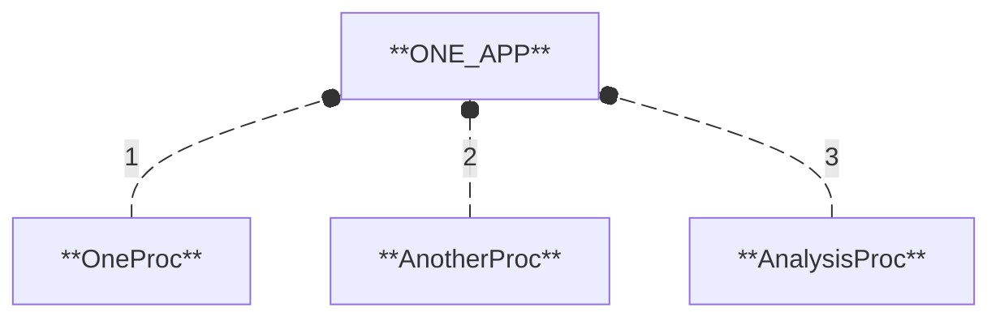
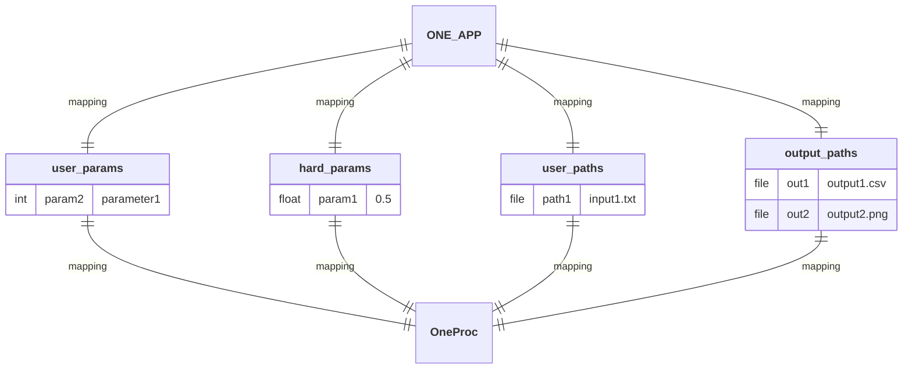
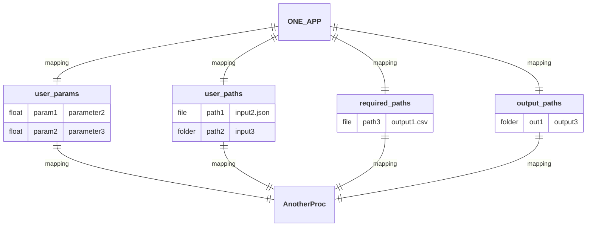
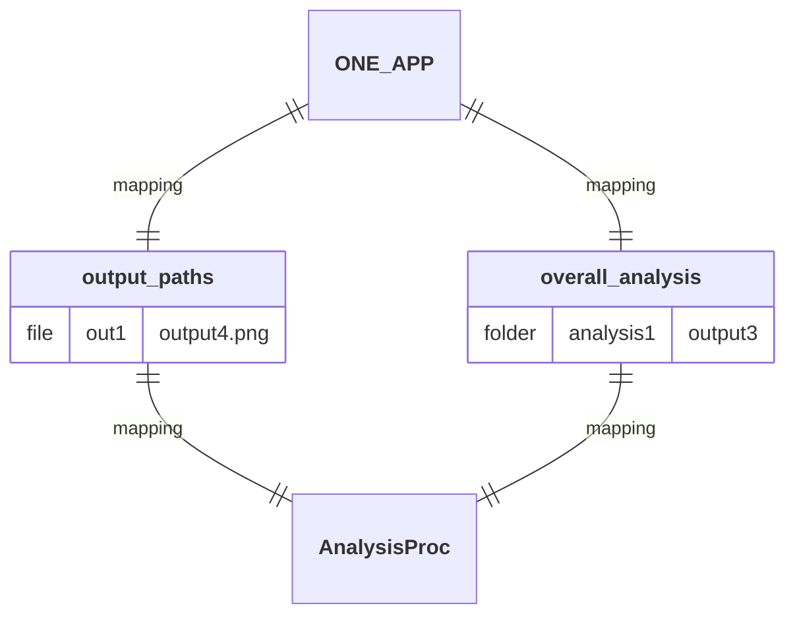
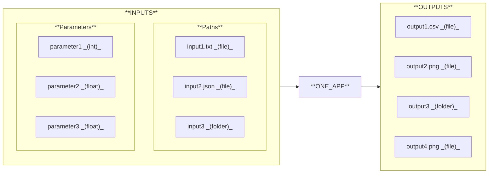

## Diagram

## Description

Simulate a projectile trajectory and compare it with the analytical solution.

## Workflow

1. **`OneProc`:** Generate and plot a regular polygon shape.
2. **`AnotherProc`:** Simulate a projectile trajectory and compare it with the analytical solution.
3. **`AnalysisProc`:** Plot and save the comparison between simulated and theoretical trajectories.

## Mapping

## I/O Interface

### INPUTS

#### Parameters

- **`parameter1`:** Number of sides of the polygon.
- **`parameter2`:** Acceleration due to gravity (can be positive or negative).
- **`parameter3`:** Mass of the projectile (used in the simulation).

#### Paths

- **`input1.txt`:** File containing the plot title.
- **`input2.json`:** File containing initial conditions (v0, h0, angle).
- **`input3/`** 
  - **`solver_config.json`:** File containing the parameters for solver configuration.
  - **`display_config.json`:** File containing the parameters for display configuration.

### OUTPUTS

- **`output1.csv`:** File containing the X/Y coordinates of the polygon vertices.
- **`output2.png`:** Image of the plotted polygon figure.
- **`output3/`**
  - **`results.xlsx`:** File containing model and theoritical trajectories.
  - **`model_vs_theory.png`:** Image comparing both trajectories.
- **`output4.png`:** Image comparing both trajectories across all experiments.