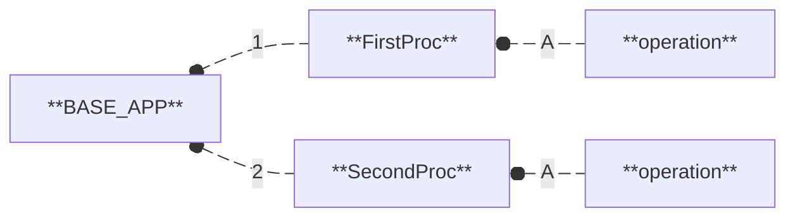
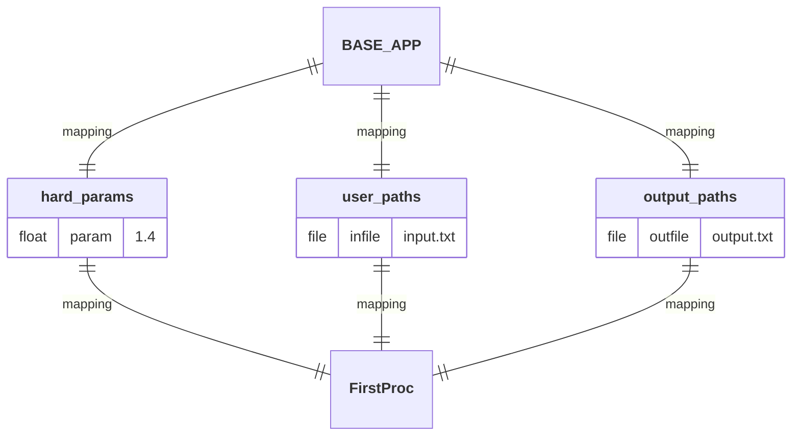
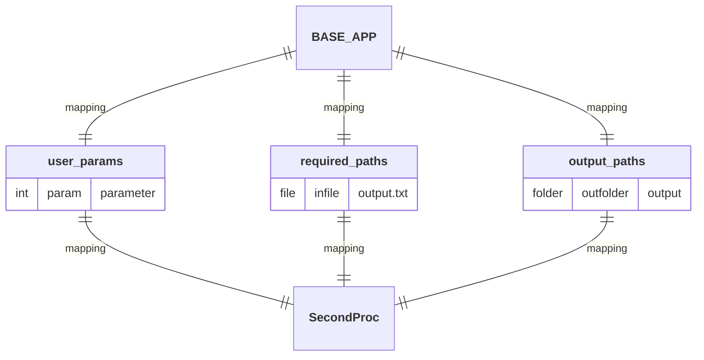
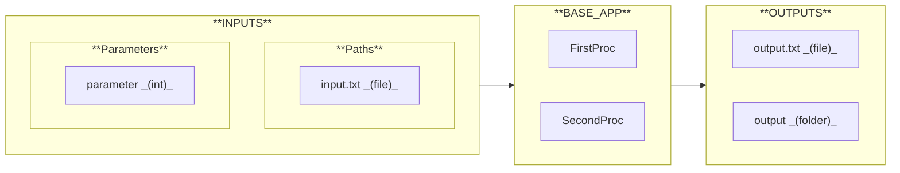
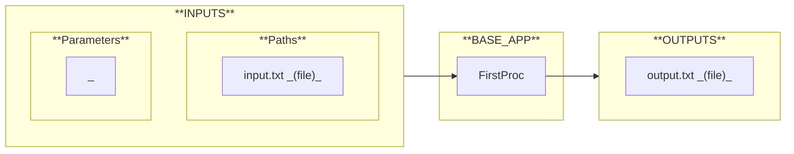
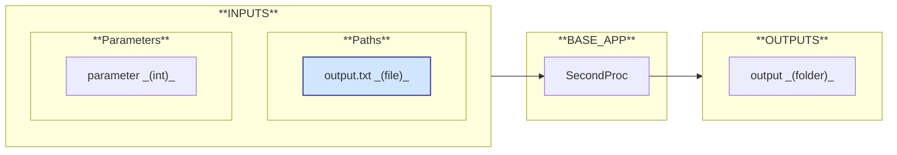

# BASE_APP

  

## Workflow

1. **[`FirstProc`](https://github.com/nuremics/nuremics-labs/tree/main/src/labs/apps/general/BASE_APP/procs/FirstProc):** Description of the Proc. 
  A/ **`operation`:** Description of the operation.
2. **[`SecondProc`](https://github.com/nuremics/nuremics-labs/tree/main/src/labs/apps/general/BASE_APP/procs/SecondProc):** Description of the Proc. 
  A/ **`operation`:** Description of the operation.

## Mapping

## I/O Interface

### INPUTS

#### Parameters

- **`parameter`:** Description of the parameter.

#### Paths

- **`input.txt`:** Description of the file.

### OUTPUTS

- **`output/`** 
  **`output1.txt`:** Description of the file. 
  **`output2.txt`:** Description of the file.