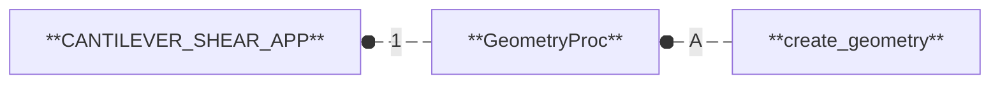
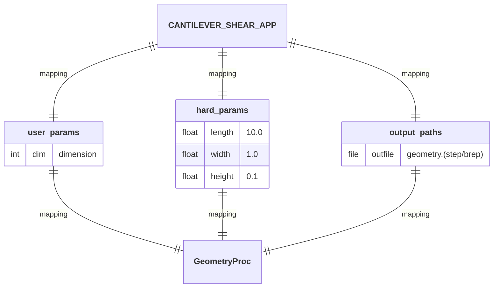
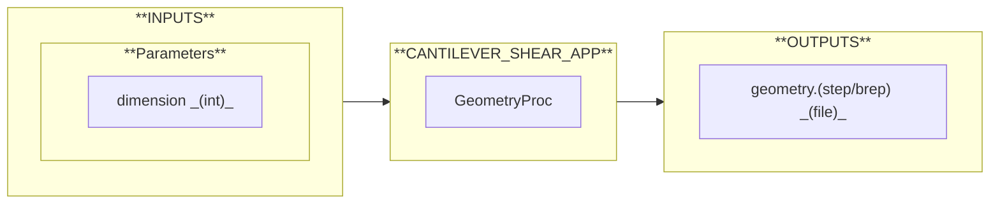
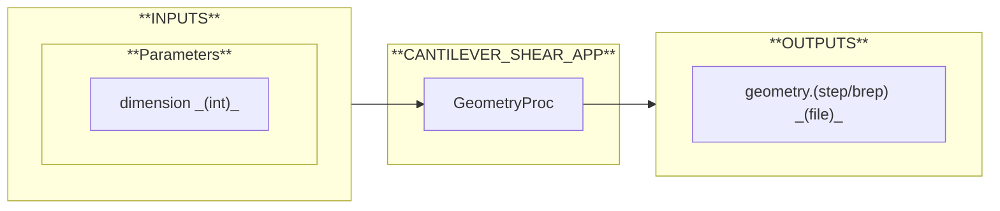

# CANTILEVER_SHEAR_APP

  

## Workflow

1. **[`GeometryProc`](https://github.com/nuremics/nuremics-labs/tree/cantilever-shear/src/labs/apps/cms/CANTILEVER_SHEAR_APP/procs/GeometryProc):** Create a geometric representation of a physical system. 
  A/ **`create_geometry`:** Create and export a simple geometric entity (beam, plate, or block) in STEP or BREP format.

## Mapping

## I/O Interface

### INPUTS

#### Parameters

- **`dimension`:** Dimension of the geometry: 1 for a line (beam), 2 for a rectangle (plate), 3 for a box (block).

### OUTPUTS

- **`geometry.(step/brep)`:** File containing the created geometry (in .step if `dimension` = 3|2 or .brep if `dimension` = 1).