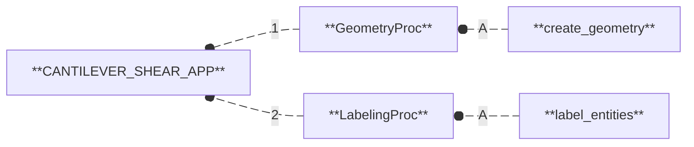

# CANTILEVER_SHEAR_APP

  
  
  
  

## Workflow

1. **[`GeometryProc`](procs/GeometryProc.md):** Create a geometric representation of a physical system. 
  A/ **`create_geometry`:** Create and export a simple geometric entity (beam, plate, or block) in STEP or BREP format.
2. **[`LabelingProc`](procs/LabelingProc.md):** Define and label the entities of a physical system from its geometric representation. 
  A/ **`label_entities`:** Assign labels to the entities of a geometric model.

## Mapping

## I/O Interface

### INPUTS

#### Parameters

- **`dimension`:** Dimension of the geometry: 1 for a line (beam), 2 for a rectangle (plate), 3 for a box (block).

#### Paths

N/A

### OUTPUTS

- **`geometry.(step/brep)`:** File containing the geometric model (in .step if `dim` = 3|2 or .brep if `dim` = 1).
- **`labels.json`:** File containing the labeled geometric entities.