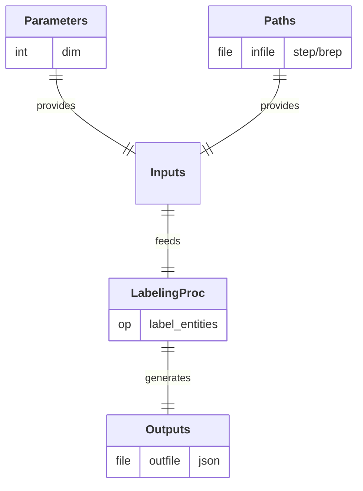

# LabelingProc

  
  

## Process

Define and label the entities of a physical system from its geometric representation. 
A/ **`label_entities`:** Assign labels to the entities of a geometric model.

## Input Parameter(s)

- **`dim`:** Dimension of the geometry: 1 for a line (beam), 2 for a rectangle (plate), 3 for a box (block).

## Input Path(s)

- **`infile`:** File containing the geometric model (in .step if `dim` = 3|2 or .brep if `dim` = 1).

## Output Path(s)

- **`outfile`:** File containing the labeled geometric entities.