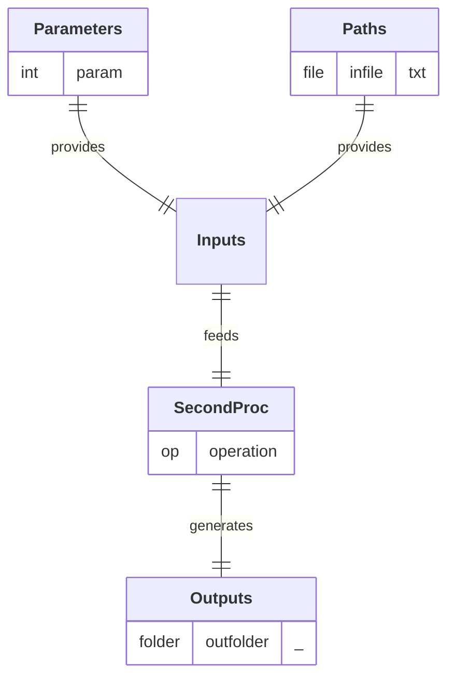

# SecondProc

  

## Process

Description of the Proc. 
A/ **`operation`:** Description of the operation. 

## Input Parameter(s)

- **`param`:** Description of the parameter.

## Input Path(s)

- **`infile`:** Description of the file.

## Output Path(s)

- **`outfolder/`** 
  **`output1.txt`:** Description of the file. 
  **`output2.txt`:** Description of the file.