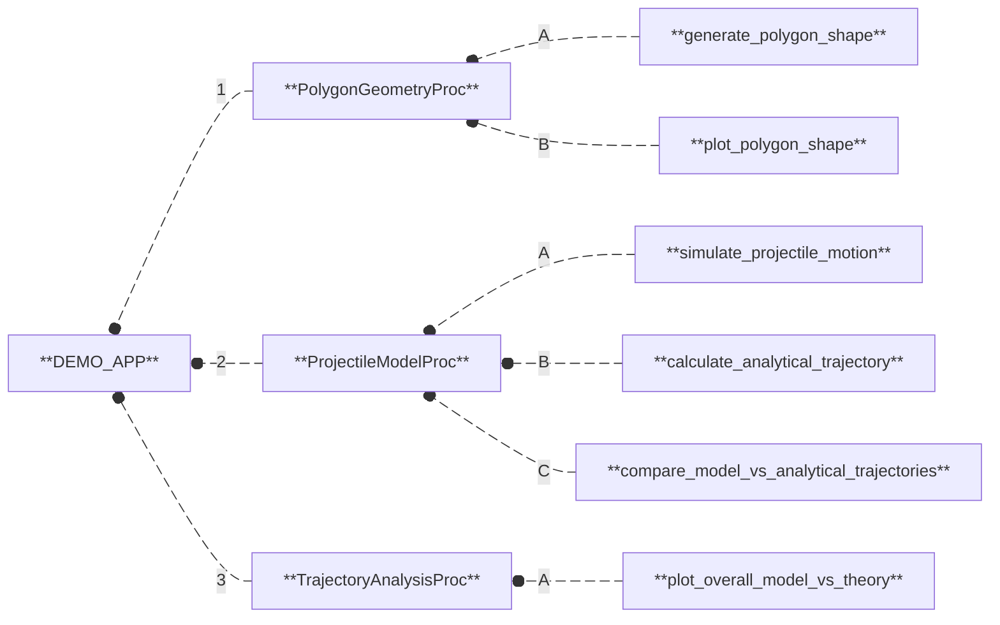
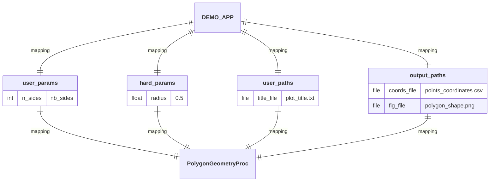
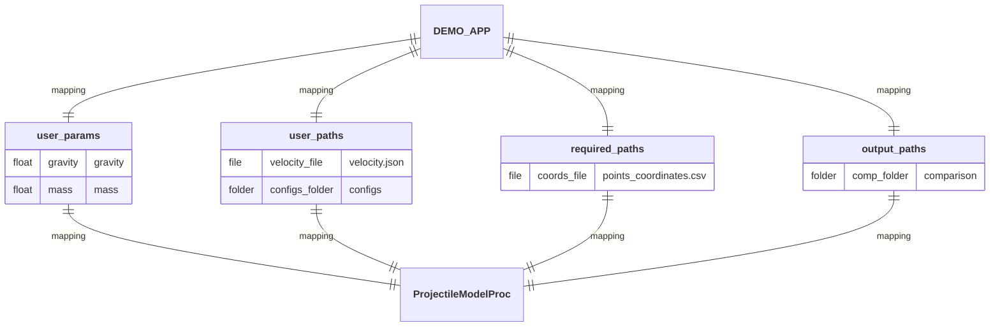
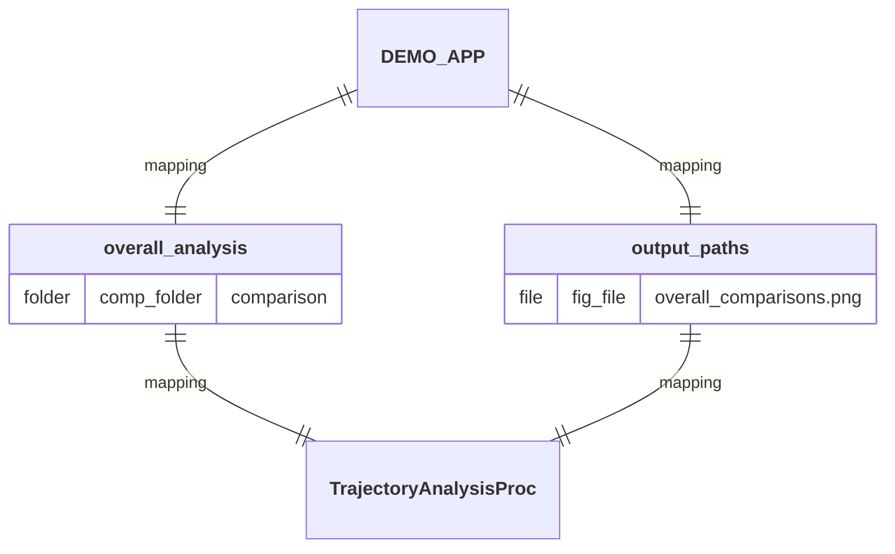
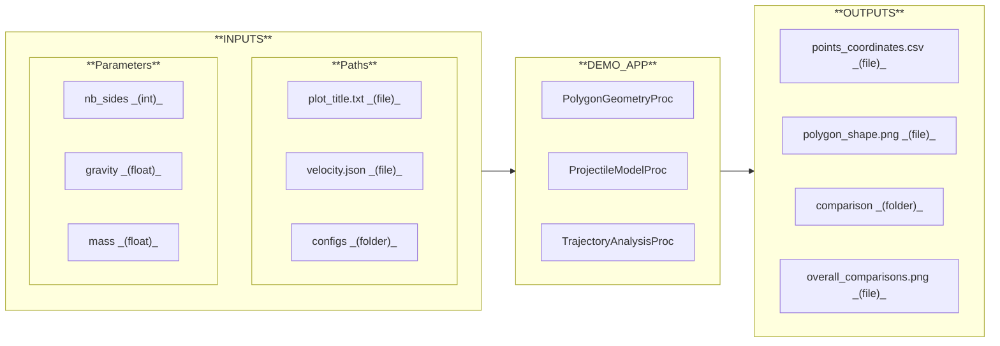
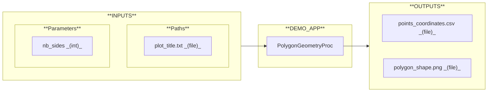
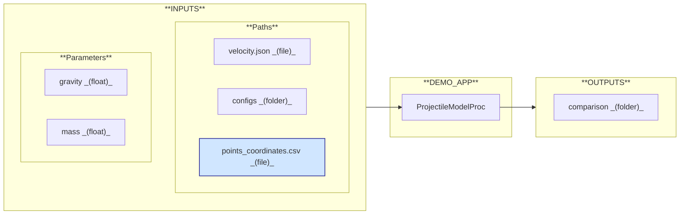
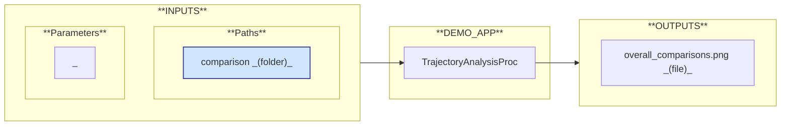

# DEMO_APP

  
  
  
  
  
  
  

## Workflow

1. **`PolygonGeometryProc`:** Generate and plot a regular 2D polygon shape. 
  A/ **`generate_polygon_shape`:** Generate the 2D coordinates of a regular polygon. 
  B/ **`plot_polygon_shape`:** Plot a closed 2D polygon from a set of points.
2. **`ProjectileModelProc`:** Simulate the motion of a projectile and compare its trajectory with the analytical solution. 
  A/ **`simulate_projectile_motion`:** Simulate the motion of a 2D rigid body under gravity projected with an initial velocity. 
  B/ **`calculate_analytical_trajectory`:** Calculate the theoretical trajectory of a projectile using analytical equations. 
  C/ **`compare_model_vs_analytical_trajectories`:** Plot and save the comparison between simulated (model) and theoretical projectile trajectories.
3. **`TrajectoryAnalysisProc`:** Perform overall comparisons between simulated (model) and theoretical trajectories. 
  A/ **`plot_overall_model_vs_theory`:** Generate overall comparative plots of simulated (model) and theoritical trajectories.

## Mapping

## I/O Interface

### INPUTS

#### Parameters

- **`nb_sides`:** Number of sides of the polygon.
- **`gravity`:** Gravitational acceleration (m/s²).
- **`mass`:** Mass of the body (kg).

#### Paths

- **`plot_title.txt`:** File containing the plot title of the 2D polygon shape.
- **`velocity.json`:** File containing the velocity initial conditions {v0 (m/s); angle (°)}.
- **`configs/`**  
  **`solver_config.json`:** File containing the parameters for solver configuration.  
  **`display_config.json`:** File containing the parameters for display configuration.

### OUTPUTS

- **`points_coordinates.csv`:** File containing the X/Y coordinates of the polygon vertices.
- **`polygon_shape.png`:** Image of the plotted polygon figure.
- **`comparison/`**  
  **`results.xlsx`:** File containing simulated (model) and theoritical trajectories.  
  **`model_vs_theory.png`:** Image comparing both trajectories.
- **`overall_comparisons.png`:** Image containing overall comparative plots.