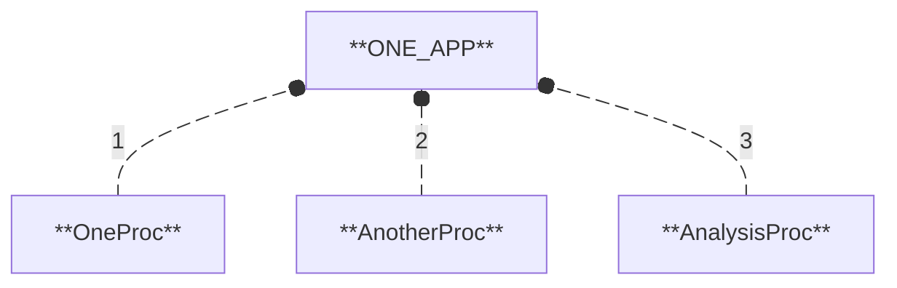
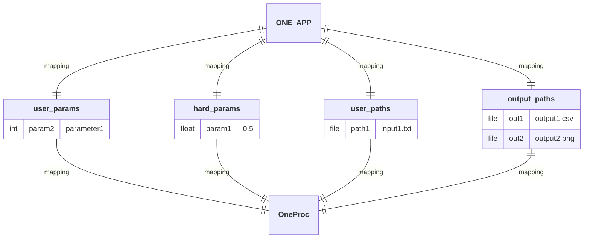
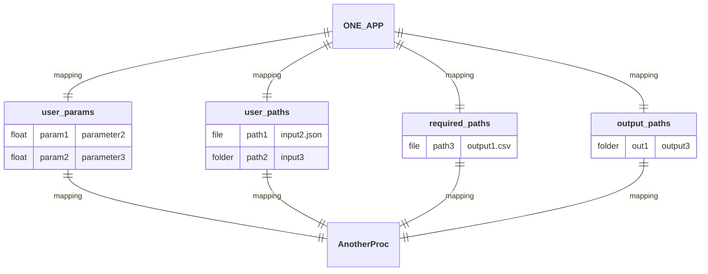
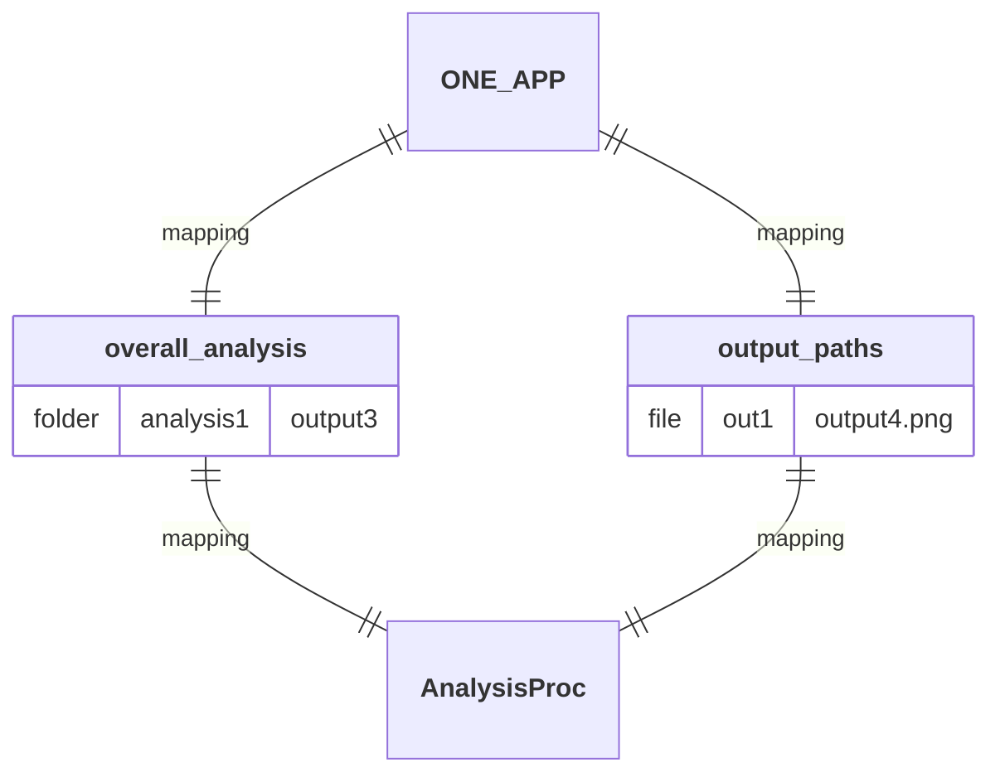
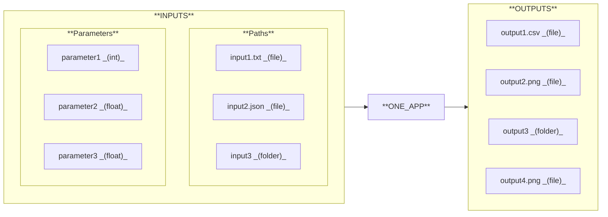

## Diagram

## Description

Generate and plot a regular 2D polygon shape to define the geometry of a projectile, simulate its trajectory, compare the simulated motion with the analytical solution, and produce comparative plots across all experiments.

## Workflow

1. **`OneProc`:** Generate and plot a regular 2D polygon shape. 
  1.1. **`operation1`:** Generate the 2D coordinates of a regular polygon (given radius and number of sides). 
  1.2. **`operation2`:** Plot the shape with a title read from an external file.
2. **`AnotherProc`:** Simulate a projectile trajectory and compare it with the analytical solution. 
  2.1. **`operation1`:** Run the physical simulation of a projectile. 
  2.2. **`operation2`:** Compute the theoretical trajectory using analytical equations. 
  2.3. **`operation3`:** Plot and save the comparison between simulated (model) and theoretical trajectories.
3. **`AnalysisProc`:** Compare simulated (model) and theoretical trajectories of a projectile across all experiments. 
  3.1. **`operation1`:** Generate overall comparative plot of simulated (model) and theoritical trajectories.

## Mapping

## I/O Interface

### INPUTS

#### Parameters

- **`parameter1`:** Number of sides of the polygon.
- **`parameter2`:** Acceleration due to gravity (can be positive or negative).
- **`parameter3`:** Mass of the projectile (used in the simulation).

#### Paths

- **`input1.txt`:** File containing the plot title of the 2D polygon shape.
- **`input2.json`:** File containing initial conditions (v0, h0, angle).
- **`input3/`** 
  - **`solver_config.json`:** File containing the parameters for solver configuration.
  - **`display_config.json`:** File containing the parameters for display configuration.

### OUTPUTS

- **`output1.csv`:** File containing the X/Y coordinates of the polygon vertices.
- **`output2.png`:** Image of the plotted polygon figure.
- **`output3/`**
  - **`results.xlsx`:** File containing simulated (model) and theoritical trajectories.
  - **`model_vs_theory.png`:** Image comparing both trajectories.
- **`output4.png`:** Image comparing both trajectories across all experiments.