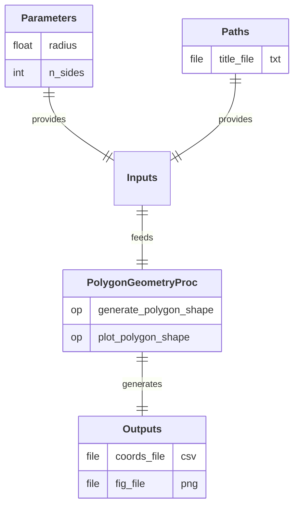

# PolygonGeometryProc

  
  
  

## Process

Generate and plot a regular 2D polygon shape. 
A/ **`generate_polygon_shape`:** Generate the 2D coordinates of a regular polygon. 
B/ **`plot_polygon_shape`:** Plot a closed 2D polygon from a set of points.

## Input Parameter(s)

- **`radius`:** Radius of the polygon.
- **`n_sides`:** Number of sides of the polygon.

## Input Path(s)

- **`title_file`:** File containing the plot title of the 2D polygon shape.

## Output Path(s)

- **`coords_file`:** File containing the X/Y coordinates of the polygon vertices.
- **`fig_file`:** Image of the plotted polygon figure.