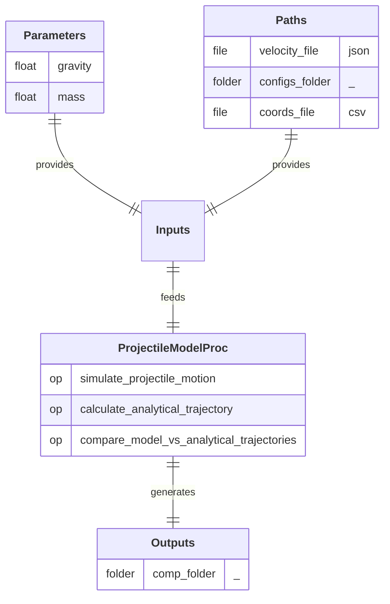

# ProjectileModelProc

  
  
  
  
  
  

## Process

Simulate projectile motion and compare its trajectory with the analytical solution. 
A/ **`simulate_projectile_motion`:** Simulate the motion of a 2D rigid body under gravity projected with an initial velocity. 
B/ **`calculate_analytical_trajectory`:** Calculate the theoretical trajectory of a projectile using analytical equations. 
C/ **`compare_model_vs_analytical_trajectories`:** Plot and save the comparison between simulated (model) and theoretical projectile trajectories.

## Input Parameter(s)

- **`gravity`:** Acceleration due to gravity (can be positive or negative).
- **`mass`:** Mass of the projectile.

## Input Path(s)

- **`velocity_file`:** File containing the velocity initial conditions (v0, angle).
- **`configs_folder/`** 
  **`solver_config.json`:** File containing the parameters for solver configuration. 
  **`display_config.json`:** File containing the parameters for display configuration.
- **`coords_file`:** File containing the X/Y coordinates of the polygonal shape to simulate.

## Output Path(s)

- **`comp_folder/`** 
  **`results.xlsx`:** File containing simulated (model) and theoritical trajectories. 
  **`model_vs_theory.png`:** Image comparing both trajectories.