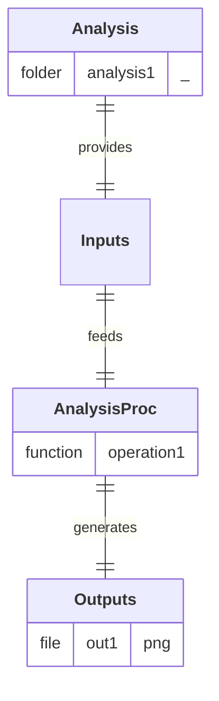

## Diagram

## Description

Compare simulated (model) and theoretical trajectories of a projectile across all experiments. 

## Pipeline

1. **`operation1`:** Generate overall comparative plot of simulated (model) and theoritical trajectories.

## Input Analysis

- **`analysis1/`**
  - **`results.xlsx`:** File containing simulated (model) and theoritical trajectories.

## Output Path(s)

- **`out1`:** Image comparing both trajectories across all experiments.