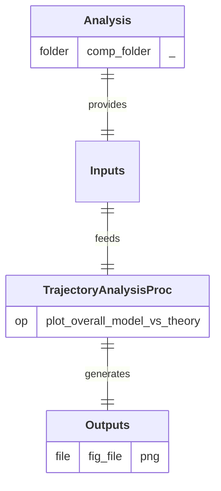

# TrajectoryAnalysisProc

  
  
  

## Process

Perform overall comparisons between simulated (model) and theoretical trajectories. 
A/ **`plot_overall_model_vs_theory`:** Generate overall comparative plots of simulated (model) and theoritical trajectories.

## Input Analysis

- **`comp_folder/`** 
  **`results.xlsx`:** File containing both trajectories.

## Output Path(s)

- **`fig_file`:** Image containing overall comparative plots.