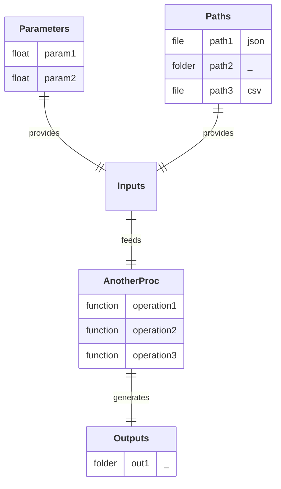

## Diagram

## Description

Simulate a projectile trajectory and compare it with the analytical solution.

## Pipeline

1. **`operation1`:** Run the physical simulation of a projectile.
2. **`operation2`:** Compute the theoretical trajectory using analytical equations.
3. **`operation3`:** Plot and save the comparison between simulated and theoretical trajectories.

## Input Parameter(s)

- **`param1`:** Acceleration due to gravity (can be positive or negative).
- **`param2`:** Mass of the projectile (used in the simulation).

## Input Path(s)

- **`path1`:** File containing initial conditions (v0, h0, angle).
- **`path2/`**
  - **`solver_config.json`:** File containing the parameters for solver configuration.
  - **`display_config.json`:** File containing the parameters for display configuration.
- **`path3`:** File with 2D coordinates ('X', 'Y') of the polygonal shape to simulate.

## Output Path(s)

- **`out1/`**
  - **`results.xlsx`:** File containing simulated (model) and theoritical trajectories.
  - **`model_vs_theory.png`:** Image comparing both trajectories.