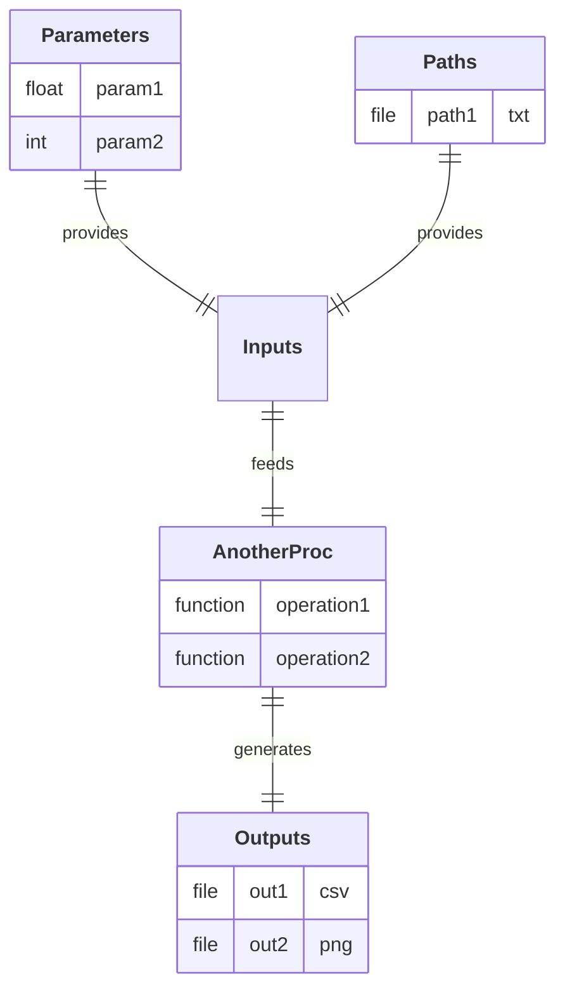

## Diagram

---

## Description

Process to generate and plot a regular polygon shape.

This class executes a two-step pipeline:
- **operation1:** Generate the 2D coordinates of a regular polygon (given radius and number of sides).
- **operation2:** Plot the shape with a title read from an external file.

---

### Input Parameter(s)

- **param1**
Radius of the polygon.

- **param2** 
Number of sides of the polygon.

---

### Input Path(s)

- **path1**  
Path to a text file containing the plot title.

---

### Output Path(s)

- **out1** 
File containing the X/Y coordinates of the polygon vertices.

- **out2**
Image of the plotted polygon figure